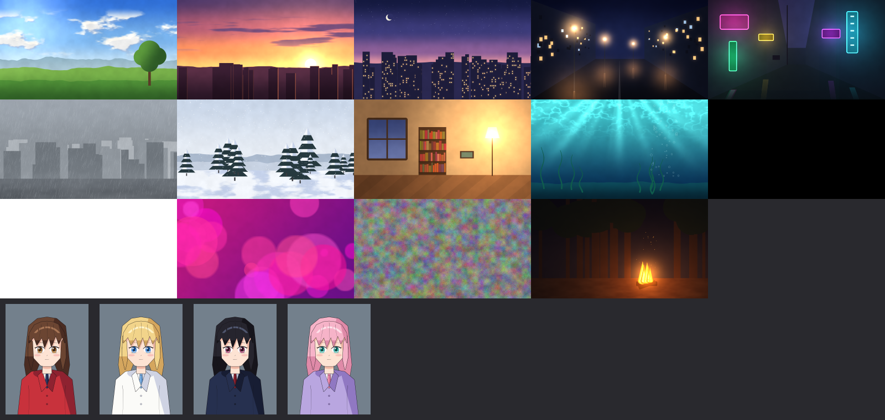

# SATSUEI 撮影

**Auto-compositing & look toolkit for Adobe After Effects.**

撮影 (*satsuei*, "photography") is what anime studios call the compositing department:
the people who combine character cels with backgrounds and add light, diffusion,
blur and grading. SATSUEI automates that work. You select a character and a background,
press **AUTO COMP**, and the character picks up the scene's light, black level,
contrast, atmosphere, edge light and texture. A finishing Look goes on top.

- Built only from **After Effects' built-in effects** and expressions. Everything is
  wired to one control layer, stays editable, and can be removed.
- Projects render anywhere (`aerender`, Media Encoder, a friend's PC) **without SATSUEI
  installed**. No third-party plugins are required.
- Targets After Effects 2023 (23.0) and newer, on Windows and macOS.

> **Status: early development (Phase 0/1).** The analysis and color-matching math, the
> scene classifier, the PNG decoder, the AE bridge tooling and the synthetic test assets
> are in place and tested in Node. The AE-side analyzer is written but has not run on AE
> yet. The panel is a placeholder, and AUTO COMP arrives in Phase 2. See `docs/reports/`.



## For developers

```
npm install
npm test           # ES3 lint + unit tests
npm run build      # dist/Satsuei.jsx
npm run doctor     # checks your After Effects setup
```

See `CLAUDE.md` for conventions, `docs/DECISIONS.md` for verified findings, and
`docs/ALGORITHMS.md` for the math.

## License

Apache-2.0 (see `LICENSE`).
